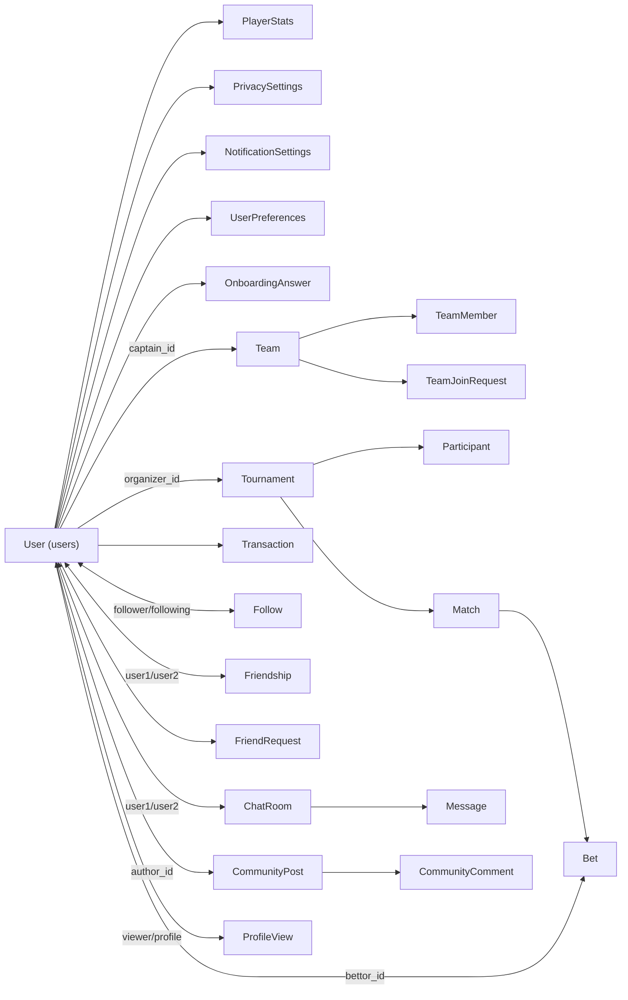

# AGENTS.md — карта системы Underground Arena для AI-агентов

**Обязательное чтение перед любой задачей в этом репозитории.** Этот файл — не советы, а контракт. Часть пунктов — проверенные построчно факты о текущем коде (сверено 09.07.2026), часть — фиксированные правила, обязательные при любых изменениях.

Главная задача файла: чтобы любой агент, начиная новую задачу, за 5 минут понимал, что уже есть рядом и откуда это брать — вместо того чтобы независимо пересоздавать то, что уже посчитано, отображено или сохранено где-то ещё.

---

## 0. Приоритет источников правды

1. **Реальный код** (`backend/src/entities/*`, `backend/src/modules/*`, `frontend/src/types/index.ts`) — всегда главнее любого документа, включая этот.
2. **Этот файл (AGENTS.md).**
3. `README.md` — архитектуру описывает в целом верно, но местами описывает *желаемое*, а не то, что реально в коде (пример — §3.5, кошелёк). Не копировать код из README без сверки с `entities/`.
4. `docs/*.md` — заметки прошлых агентов. Устарели или избыточны местами, см. §9. Не источник правды по архитектуре.

Если источники противоречат друг другу — правда там, где выше в списке.

---

## 1. Стек и топология (факт)

| | |
|---|---|
| Backend | NestJS 10, TypeORM 0.3, PostgreSQL 15. Модульный монолит: `backend/src/modules/*` |
| Frontend | Next.js 14.2 (App Router), React 18, Zustand, Tailwind, Socket.IO client |
| Реалтайм | Socket.IO — `backend/src/modules/chat/chat.gateway.ts` |
| Инфра | docker-compose: `postgres`, `backend`, `frontend`, `nginx` |
| API | Глобальный префикс `/api` (`main.ts`). Swagger уже настроен на `/api/docs` |
| Auth | JWT + Passport + OAuth2 (Google, Discord). Guard'ы/декораторы — см. §3.1, это готовый эталонный паттерн |

Backend-модули: `auth`, `users`, `tournaments` (+`matches`), `participants`, `bets`, `wallet`, `teams`, `friends`, `chat`, `community`, `settings`, `account`.

⚠️ В коде модуль называется `friends`, не `social`, как в README. Ориентируйся на реальные имена папок, а не на текст README.

---

## 2. Главный принцип: подтягивай, не переизобретай

Перед тем как писать код, создающий, отображающий или обновляющий что-либо, связанное с пользователем, турниром, командой и т.д. — обязательная последовательность:

1. **Ищи существующий тип:** `grep -n "interface\|^export type" frontend/src/types/index.ts`. Почти все нужные поля уже там.
2. **Ищи существующий метод сервиса.** Нужная выборка почти наверняка уже где-то есть (карта — §3). Не пиши новый `repo.find(...)`/SQL, если подходящий метод существует — переиспользуй или расширь его.
3. **Ищи существующий компонент:** `frontend/src/components/ui/*` (`Avatar`, `Badge`, `Card`, `Modal`, `Dropdown`, `Tabs`, `Navbar`, `Sidebar` и т.д.). Не рисуй новую вёрстку аватарки/карточки, если похожий компонент уже есть.
4. **Нашёл, но "не совсем то":** расширяй (добавь опциональное поле/проп/параметр), а не форкай в параллельную копию.
5. **Только если реально ничего нет** — создавай новое и клади в общее место (§4), а не внутрь одной страницы/модуля, если данные нужны больше чем в одном месте.

Коротко: **если это уже где-то посчитано, отображено или сохранено — импортируй то же место. Не пересобирай теми же данными второй независимый кусок.**

---

## 3. Карта домена



### 3.1 Профиль / User — центральная сущность

- **Таблица:** `users`, `backend/src/entities/user.entity.ts`. Сама сущность без TypeORM-связей внутри файла — связи объявлены у других сущностей через `@ManyToOne`/`@JoinColumn` в их сторону.
- **Полная сборка профиля:** `UsersService.getProfile(userId)` — `backend/src/modules/users/users.service.ts:440`. Единственное место, которое правильно собирает User + PlayerStats (с рангами) + команды + онбординг + таймеры смены username/avatar/banner/gender + arenaPower. Нужен «полный» пользователь — вызывай этот метод, не собирай заново.
- **Лёгкое отображение (карточка/строка в списке)** — должно идти через один общий хелпер, которого сейчас формально нет как общего, хотя эталон уже написан в одном из модулей. Разбор и что с этим сделать — §5.
- **Фронтенд-тип:** `User` (`types/index.ts:4`), `UserProfile` (`types/index.ts:62`).
- **Кто ссылается на User (FK-in):** Tournament, Team, Participant, Bet, Transaction, Follow, Friendship, FriendRequest, ChatRoom, Message, CommunityPost, CommunityComment, ProfileView, BlockedUser, PlayerStats, PrivacySettings, NotificationSettings, UserPreferences, OnboardingAnswer — практически всё. Любое изменение формы User потенциально задевает все эти места.
- **Роуты:** `/api/users/*` — `users.controller.ts`. Auth-примитивы для доступа к текущему пользователю: `@CurrentUser()`, `JwtAuthGuard`, `OptionalJwtAuthGuard`, `@Roles()` из `modules/auth` — уже готовый и правильный паттерн, используй именно его, не читай `req.user` напрямую.

### 3.2 Настройки — Privacy / Notifications / Preferences

- **Таблицы:** `privacy_settings`, `notification_settings`, `user_preferences` — по одной строке на пользователя (`@OneToOne`).
- Пишутся и читаются **только** внутри `backend/src/modules/settings/*`. Это не архитектурная схема, а проверенный факт — см. §6, это приоритет №1.
- **Правило:** любой код в любом другом модуле, решающий «показать ли X пользователю» (статистику, друзей, онлайн-статус, историю турниров, взрослый контент, спойлеры), обязан прочитать соответствующий флаг из `PrivacySettings`/`UserPreferences`, а не игнорировать его.

### 3.3 Соцграф — Follow / Friendship / FriendRequest / BlockedUser

- Сознательное решение (подтверждено кодом): **Follow — одностороннее подписка**, **Friendship — двустороннее, оформляется через FriendRequest**. Не путать и не сливать эти два понятия.
- «Дружба» фактически = взаимный Follow: это вычисляется в `areFriends()`, который независимо реализован в двух местах — `friends.service.ts` и `users.service.ts:745`. Дубль, см. реестр §7.
- **Роуты:** `/api/friends/*`.

### 3.4 Турниры / Матчи / Участники

- **Таблицы:** `tournaments`, `matches`, участники — `Participant` (`tournament_participants`), плюс `tournament_views`, `tournament_reports`, `saved_tournaments`.
- `Tournament.organizerId → User`. `Participant.userId → User`, `Participant.tournamentId → Tournament`. `Participant.clanId` — мягкая ссылка на `Team.id` (без FK-декоратора) при клановой регистрации.
- `GameMode` (`ffa | two_team | multi_team`) определяет, идут ставки на игрока или на командный слот (`Bet.predictedTeamSlot`).
- Списание entry fee и выплата призов — через `WalletService` (`participants.service.ts`, `tournaments.service.ts`) — сделано правильно, это эталон для §3.5.
- **Роуты:** `/api/tournaments/*`, `/api/tournaments/:id/matches/*`, участники — `/api/tournaments/:tournamentId/*`.

### 3.5 Ставки и кошелёк

- **Кошелёк — не отдельная таблица.** Баланс — колонка `credits` прямо на `users` (`user.entity.ts:139`). `README.md` показывает пример с отдельным `walletRepo`/сущностью `Wallet` — **в реальном коде этого нет**, не копируй тот пример.
- **Единственный правильный способ менять `credits`:** `WalletService.addCredits()` / `deductCredits()` (`backend/src/modules/wallet/wallet.service.ts`). Внутри — `pessimistic_write` лок на строке пользователя + запись в `transactions`. Это защита от гонок при параллельных запросах — копируй именно этот паттерн для любых будущих операций с балансом.
- **Подключено правильно:** `participants` (entry fee, возвраты), `bets`, `tournaments` (призы).
- **Подключено неправильно:** `teams` — см. реестр §7, пункт 1.
- **Роуты:** `/api/wallet/*`, `/api/bets/*`.

### 3.6 Команды / Кланы

- **Таблицы:** `teams`, `team_members`, `team_join_requests`. `Team.captainId → User`.
- Создание команды стоит 400 credits, списывается в `teams.service.ts` (`createTeam`).
- **Роуты:** `/api/teams/*`.

### 3.7 Чат

- **Таблицы:** `chat_rooms` (пара `user1Id`/`user2Id`), `messages`. Реалтайм — `ChatGateway` (Socket.IO), REST — `chat.controller.ts`.
- `FriendsModule` и `TeamsModule` оба зависят от `ChatModule` — используется для авто-создания чата при действиях в друзьях/командах.
- **Роуты:** `/api/chat/*`.

### 3.8 Community (лента)

- **Таблицы:** `community_posts`, `community_comments`, `community_post_likes`, `community_comment_likes`.
- **Это модуль-эталон** по способу отдавать данные автора в ответах API — см. разбор в §5. Копируй его подход и подними на уровень выше, не копируй его локальность.
- **Роуты:** `/api/community/*`.

---

## 4. Таблица источников правды (быстрый lookup)

| Нужны данные о… | Бэкенд: правда | Фронтенд: тип | Фронтенд: компонент |
|---|---|---|---|
| Пользователь целиком (страница профиля) | `UsersService.getProfile()` | `UserProfile` | `app/profile/[id]/page.tsx` — структуру не дублировать |
| Пользователь в списке/карточке | должно быть `toUserCard()` — создать один раз, см. §5 | должно быть `UserCard` — создать один раз, см. §5 | `Avatar.tsx` + обёртка-карточка |
| Аватар (картинка/инициалы/статус) | — | — | `components/ui/Avatar.tsx` — уже готов, всегда используй его |
| Список игр (общий) | `GameType` enum, `player-stats.entity.ts` | `GameType`, `types/index.ts` | — |
| Игры турнира (сейчас у́же общего списка!) | `TournamentGame` enum, `tournament.entity.ts` | своего типа нет — используется общий | — |
| Приватность/видимость | `PrivacySettings` | `PrivacySettings` | нигде не применяется вне settings — см. §6 |
| Баланс/кредиты | `User.credits`, менять только через `WalletService` | `User.credits`, `Transaction` | `app/wallet/*` |
| Список эндпоинтов | `backend/src/modules/*/*.controller.ts`, справочник §10 | `frontend/src/lib/api.ts` — уже единый объект `api.*` по доменам, хороший паттерн, продолжай его | — |

---

## 5. Эталон, который уже есть в коде — подними его на уровень выше

`backend/src/modules/community/community.service.ts:18-35` уже решает задачу «не пересобирать пользователя заново в каждом месте»:

```ts
const AUTHOR_FIELDS = ['id', 'username', 'displayName', 'avatarUrl', 'gender', 'mainGame', 'level'] as const;

function publicAuthor(user: User | null | undefined) {
  if (!user) return null;
  const result: Record<string, any> = {};
  for (const field of AUTHOR_FIELDS) result[field] = (user as any)[field];
  return result;
}
```

Это ровно тот «фундаментальный, связывающий» механизм, который нужен всему проекту — просто он живёт внутри одного модуля. `friends.service.ts`, `chat.service.ts`, `teams.service.ts`, `users.service.ts` (метод `searchUsers`) независимо пишут свои варианты того же самого вручную, каждый со своим набором полей. См. реестр §7, пункты 4–5.

**Что сделать (один раз, дальше остальные модули только импортируют):**

1. Вынести в новый файл `backend/src/common/user-view.ts`:

```ts
import { User } from '../entities/user.entity';

export const USER_CARD_FIELDS = [
  'id', 'username', 'displayName', 'avatarUrl', 'cardBannerUrl',
  'gender', 'mainGame', 'level', 'followersCount',
] as const;

export type UserCard = Pick<User, (typeof USER_CARD_FIELDS)[number]>;

export function toUserCard(user: User | null | undefined): UserCard | null {
  if (!user) return null;
  const result = {} as UserCard;
  for (const field of USER_CARD_FIELDS) (result as any)[field] = user[field];
  return result;
}
```

2. `community.service.ts` заменяет локальный `publicAuthor`/`AUTHOR_FIELDS` на импорт `toUserCard` из `common/`.
3. `friends.service.ts`, `chat.service.ts`, `teams.service.ts`, `users.service.ts` (`searchUsers`) переводятся на тот же `toUserCard` вместо ручной сборки объекта.
4. На фронтенде — зеркально, в `frontend/src/types/index.ts`:

```ts
export interface UserCard {
  id: string;
  username: string;
  displayName?: string;
  avatarUrl?: string;
  cardBannerUrl?: string;
  gender?: Gender;
  mainGame?: GameType;
  level?: number;
  followersCount?: number;
}
```

`SocialUser`, `UserSearchResult`, `LeaderboardEntry['user']`, `TeamJoinRequest['user']`, `BlockedUser['blockedUser']`, `CommunityPost['author']`, `CommunityComment['author']` — переписать через `UserCard & { поля, которых реально больше нигде нет }` (например, `UserSearchResult` добавляет только `friendshipStatus`), а не как независимые интерфейсы со случайно совпадающими полями.

5. Любая вёрстка аватара — только `<Avatar src={x.avatarUrl} alt={x.displayName || x.username} />` из `components/ui/Avatar.tsx`. Сейчас вручную нарисован fallback-круг с первой буквой в: `app/chat/page.tsx`, `app/friends/page.tsx` (3 места в одном файле), `app/teams/[id]/page.tsx`, `components/betting/BettingPanel.tsx`, `components/tournaments/ParticipantsList.tsx`, `components/tournaments/TeamSlotPicker.tsx`. Сделано правильно в `app/community/[id]/page.tsx`, `components/community/PostCard.tsx`, `components/ui/ProfileDropdown.tsx` — ориентируйся на них.

---

## 6. Приоритет №1: настройки нужно реально применять

Проверено по коду: `PrivacySettings`, `NotificationSettings`, `UserPreferences` **сохраняются, но нигде не читаются за пределами модуля `settings`.** Ни один другой сервис их не импортирует. Прямо сейчас это значит:

- Пользователь ставит профиль в «только для друзей» — профиль всё равно виден всем: `getProfile`, `searchUsers` не проверяют `profileVisibility`.
- Пользователь скрывает статистику/друзей/историю турниров (`canSeeStats`, `canSeeFriends`, `showTournamentHistory`) — флаги нигде не читаются.
- Пользователь выключает «показывать посетителей профиля» (`showProfileVisitors`) — `getProfileVisitors()` всё равно отдаёт список.
- Пользователь меняет тему/язык/акцент (`UserPreferences`) — фронтенд это нигде не применяет за пределами страницы настроек (нет `ThemeProvider`, читающего `preferences.theme`).
- Пользователь включает «скрывать неинтересные турниры» / фильтр по региону / `minPrizePoolFilter` — список турниров это не учитывает.
- `NotificationSettings` — честная ситуация: отправки email/push в коде пока нет вообще ни одной, флаги не «игнорируются», а «ждут, пока появится то, что должно их проверять». Когда будешь делать любую отправку уведомлений — веди её только через чтение соответствующего флага, не отправляй «молча всем».

**Фиксированное правило:** в задаче вида «показать X о пользователе Y пользователю Z» обязательный шаг — прочитать `PrivacySettings` пользователя Y и применить ограничение до возврата данных, а не после.

---

## 7. Реестр известных расхождений

| # | Где | Что не так | Куда сходится |
|---|---|---|---|
| 1 | `teams/teams.service.ts:133` | Списание 400 credits за команду идёт напрямую `usersRepo.decrement(...)`, в обход `WalletService`: нет записи в `transactions`, нет лока. `WalletModule` при этом **уже импортирован** в `teams.module.ts` — просто не заинжектирован в сервис. Неиспользуемые `TransactionType.CLAN_CREATE`/`CLAN_REFUND` в коде подтверждают, что задумано было иначе. | `walletService.deductCredits(captainId, 400, TransactionType.CLAN_CREATE, team.id)`, как в `bets`/`participants`. |
| 2 | `user.entity.ts` и `player-stats.entity.ts` (`GameType`, идентичный дубль), `tournament.entity.ts` (`TournamentGame`, узкий вариант), `frontend/types/index.ts:2` (`GameType`, ещё один узкий вариант) | 4 независимых списка игр. Бэкенд поддерживает `fortnite, rocket_league, overwatch2, rainbow6, fifa` — на фронтенде их нет вообще (0 упоминаний во всём `frontend/src`). Если это значение когда-нибудь придёт с бэка — фронт не отрисует его корректно. | Один enum-источник (например, оставить в `player-stats.entity.ts`, остальное — импортировать его). Фронтендный `GameType` — привести 1:1 к бэкендному. `TournamentGame` уже, чем общий список — либо это осознанно (тогда зафиксируй причину прямо в этом разделе одной строкой), либо тоже слить в общий список. |
| 3 | `users.service.ts:745` и `friends.service.ts` (`areFriends`) | Одна и та же логика «дружба = взаимный follow» реализована дважды. | Одна реализация в `FriendsService`, `UsersService` вызывает через DI. |
| 4 | `friends.service.ts`, `chat.service.ts`, `teams.service.ts`, `users.service.ts` (`searchUsers`) | Каждый вручную собирает объект пользователя из своего набора полей вместо одной функции. | `toUserCard()`, см. §5. |
| 5 | `frontend/src` — 6 файлов, список в §5 п.5 | Аватар нарисован вручную вместо `<Avatar />`. | См. §5. |
| 6 | `app.module.ts:66` | Все 27 сущностей перечислены вручную одним массивом `entities: [...]`. Забыл добавить новую — TypeORM её просто не увидит. | Автозагрузка: `entities: [__dirname + '/entities/**/*.entity{.ts,.js}']`. Локальный `TypeOrmModule.forFeature([...])` в каждом модуле — оставить, это нормально и нужно для DI. |
| 7 | `app.module.ts:67` (`synchronize: true`) + `database/migrations/*.sql` (4 файла) | Схема БД накатывается автоматически из `entities/` при каждом старте; параллельно есть 4 пронумерованных `.sql`-файла, не подключённых ни к какому migration runner’у — по факту заметки «что когда-то поменялось», а не рабочая миграционная цепочка. | Осознанное решение о продакшн-стратегии — за человеком, не за агентом. Не выключай `synchronize` и не «чини» миграции самостоятельно без отдельного запроса. Актуальна только схема из `entities/`, не файлы в `migrations/`. |
| 8 | `README.md`, раздел про Wallet | Показывает код с `this.walletRepo.findOne(...)`, `wallet.balance` — такой сущности `Wallet` в проекте нет. | См. §3.5 — реальный путь: `WalletService` + колонка `credits` на `User`. |
| 9 | `community.controller.ts`, `friends.controller.ts`, `chat.controller.ts` (и отчасти `auth.controller.ts`) | Читают `req.user` напрямую вместо `@CurrentUser()`. | `@CurrentUser()` из `modules/auth` — используй его в новом коде, не добавляй ещё одно место с `req.user`. |

Не нужно чинить всё сразу одним PR. Правило: **если в любом случае трогаешь этот файл/область — приведи её к варианту из правого столбца, а не оставляй как есть и не добавляй ещё один параллельный вариант того же самого.**

---

## 8. Жёсткие правила (шпаргалка)

- Отображение пользователя — всегда `Avatar.tsx` + `UserCard`/`UserProfile`. Никогда не пиши новый JSX вида `avatarUrl ?  : <буква>`.
- `credits` меняется только через `WalletService`. Никогда не трогай `user.credits`/`usersRepo.decrement/increment` напрямую из другого модуля.
- Перед тем как отдать чужие данные (статистика, друзья, история, онлайн-статус) — проверь `PrivacySettings`. Не полагайся на то, что «настройки есть, значит применяются»: проверено, что применяются только внутри самого `settings`.
- Новое значение enum (игра, статус и т.п.) — сразу и в бэкенд-источник, и в `frontend/src/types/index.ts`, одним PR. Не добавляй только с одной стороны.
- Перед тем как писать новый `interface`/сервис/компонент — пройди чек-лист §2.
- Доступ к текущему пользователю — только `@CurrentUser()` / `JwtAuthGuard` / `OptionalJwtAuthGuard` / `@Roles()` из `modules/auth`. Не читай `req.user` напрямую в новом коде.
- Новая сущность — в `backend/src/entities/`, регистрируется в `TypeOrmModule.forFeature` своего модуля. В `app.module.ts` — только если автозагрузка (реестр §7 п.6) ещё не включена.
- Новый переиспользуемый UI-элемент — в `frontend/src/components/ui/`. Специфичный для одной фичи — в `components/<домен>/`.
- Новый тип, нужный больше чем в одном файле — в `frontend/src/types/index.ts`, не в файле страницы.

---

## 9. Что делать с `docs/`

В `docs/` — 15 файлов, ~4800 строк. Из них 9 файлов (~2500 строк) — про модуль `settings`, у которого весь реальный код (`settings.service.ts` + `settings.controller.ts`) — 310 строк. Это тот же паттерн «переписали заново вместо того чтобы дополнить одно место», только применительно к документации, а не к коду.

Правило на будущее:

- Архитектурные факты — только в этом файле, в разделе, к которому они относятся. Не создавать `<ФИЧА>_COMPLETE.md`, `<ФИЧА>_SUMMARY.md`, `<ФИЧА>_FINAL_SUMMARY.md` по итогам задачи.
- Нужен лог того, что сделано — один общий `CHANGELOG.md`, короткая запись на задачу (дата / что / зачем), не отдельный файл на каждую фичу.
- Старые файлы в `docs/` можно не читать перед задачей: не обновлялись синхронно с кодом. Например, `IMPROVEMENTS_PLAN.md` почти весь уже реализован (friends/chat/tournamentType есть в коде), но оформлен как план, а не как факт.
- Разово стоит перенести из них в этот файл то немногое, что не устарело и сюда ещё не попало — после этого `docs/*.md` (кроме нового `CHANGELOG.md`) можно архивировать одной папкой `docs/archive/`.

---

## 10. Справочник роутов

| Префикс | Контроллер |
|---|---|
| `/api/auth` | `auth/auth.controller.ts` |
| `/api/users` | `users/users.controller.ts` |
| `/api/tournaments`, `/api/tournaments/:id/matches` | `tournaments/tournaments.controller.ts`, `matches.controller.ts` |
| `/api/tournaments/:tournamentId/*` (участники) | `participants/participants.controller.ts` |
| `/api/bets` | `bets/bets.controller.ts` |
| `/api/wallet` | `wallet/wallet.controller.ts` |
| `/api/teams` | `teams/teams.controller.ts` |
| `/api/friends` | `friends/friends.controller.ts` |
| `/api/chat` | `chat/chat.controller.ts` |
| `/api/community` | `community/community.controller.ts` |
| `/api/settings` | `settings/settings.controller.ts` |
| `/api/account` | `account/account.controller.ts` |

Полный список с телами запросов — Swagger, `/api/docs` (уже настроен в `main.ts`, включать ничего дополнительно не нужно).

---

Если во время задачи выяснится, что что-то здесь устарело — обнови соответствующий раздел этого файла в том же PR, а не создавай отдельную заметку рядом.
