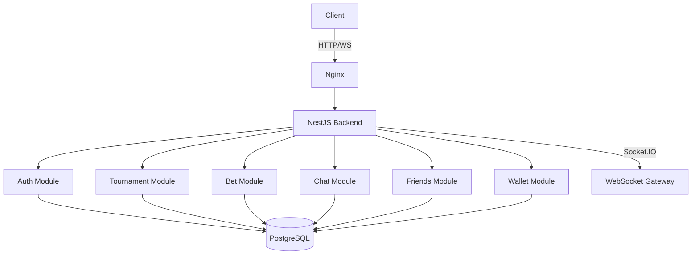

<div align="center">

# 🎮 Cube Arena

### Platform for competitive gaming tournaments with betting system and social interaction

[](LICENSE)
[](https://www.typescriptlang.org/)
[](https://nestjs.com/)
[](https://nextjs.org/)
[](https://www.postgresql.org/)
[](https://www.docker.com/)

[Demo](#-demonstration) • [Features](#-key-features) • [Architecture](#-architecture) • [Setup](#-quick-start)

<!-- Placeholder for demo GIF/video -->


🌍 **[English](README_EN.md) | [Русский](README_RU.md)**

</div>

---

## 📋 Table of Contents

- [About the Project](#-about-the-project)
- [Key Features](#-key-features)
- [Technology Stack](#-technology-stack)
- [Architecture](#-architecture)
- [Quick Start](#-quick-start)
- [Development](#-development)
- [API Documentation](#-api-documentation)
- [Deployment](#-deployment)
- [FAQ](#-faq)
- [License](#-license)

---

## 🎯 About the Project

**Cube Arena** is a full-stack platform for organizing esports tournaments with an integrated betting system, social interaction, and team management. Suitable for both small local tournaments and large esports events.

### Target Audience
- 🏆 Tournament Organizers
- 🎮 Players (solo and team compositions)
- 👥 Viewers and Fans
- 👔 Team Managers

### Why Cube Arena?
- ✅ **Self-hosted** — complete data control
- ✅ **Open Source** — transparency and customization options
- ✅ **Production Ready** — tested and deployment-ready
- ✅ **Scalable** — microservices architecture
- ✅ **Secure** — JWT authentication, OAuth2, Rate Limiting

---

## ✨ Key Features

### 🏆 Tournament System
- Create and manage tournaments (Single/Double Elimination, Round Robin)
- Automatic tournament bracket generation
- Track participant statistics
- Ranking and achievement systems
- Tournament bookmarks

### 💰 Betting System
- Internal currency (Credits)
- Real-time match betting
- Transaction history
- Manipulation protection
- Automatic payout calculation

### 👥 Social Functions
- User profiles with customizable privacy settings
- Friends system and Follow functionality
- Team interaction
- User blocking
- Privacy settings

### 💬 Communication
- Real-time chat (Socket.IO)
- Direct messaging
- Group chats
- Notifications (Email, Push, In-app)

### ⚙️ Account Management
- Profile editing
- Email and password change
- Two-factor authentication (2FA)
- OAuth integration (Google, Discord)
- GDPR compliance (data export, account deletion)

### 🎨 User Experience
- Responsive design
- Dark/Light theme
- Multilingual support
- 3D visualization (Three.js)
- Animations (Framer Motion)

---

## 🛠 Technology Stack

### Backend


- **Framework**: NestJS 10.0
- **Language**: TypeScript 5.1
- **Database**: PostgreSQL 15+ with TypeORM
- **Authentication**: JWT, Passport.js, OAuth2
- **WebSockets**: Socket.IO for real-time communication
- **Validation**: class-validator, class-transformer
- **Documentation**: Swagger/OpenAPI
- **Security**: Rate Limiting, CORS, Helmet

### Frontend


- **Framework**: Next.js 14.2 (App Router)
- **Language**: TypeScript 5.3
- **UI Library**: React 18.3
- **Styling**: TailwindCSS 3.4
- **3D Graphics**: Three.js, React Three Fiber
- **Animations**: Framer Motion
- **State Management**: Zustand
- **Forms**: React Hook Form + Zod
- **HTTP Client**: Axios
- **Icons**: Lucide React

### DevOps


- **Containerization**: Docker, Docker Compose
- **Web Server**: Nginx (reverse proxy)
- **CI/CD**: GitHub Actions ready

---

## 🏗 Architecture

### Project Structure

```
cube-arena/
├── backend/                    # NestJS API
│   ├── src/
│   │   ├── modules/           # Business modules
│   │   │   ├── auth/         # Authentication (JWT, OAuth)
│   │   │   ├── users/        # User management
│   │   │   ├── tournaments/  # Tournament system
│   │   │   ├── matches/      # Match management
│   │   │   ├── bets/         # Betting system
│   │   │   ├── teams/        # Team interaction
│   │   │   ├── chat/         # Real-time chat
│   │   │   ├── friends/      # Social graph
│   │   │   ├── wallet/       # Balance management
│   │   │   ├── settings/     # User settings
│   │   │   ├── account/      # Account management
│   │   │   ├── community/    # Community & events
│   │   │   └── participants/ # Tournament participants
│   │   ├── entities/         # TypeORM entities (23 tables)
│   │   ├── database/         # Migrations & initialization
│   │   └── main.ts           # Entry point
│   ├── Dockerfile
│   └── package.json
│
├── frontend/                   # Next.js App
│   ├── src/
│   │   ├── app/              # Next.js App Router
│   │   │   ├── auth/         # Auth pages
│   │   │   ├── tournaments/  # Tournament list & details
│   │   │   ├── profile/      # User profiles
│   │   │   ├── settings/     # Settings pages
│   │   │   ├── teams/        # Team management
│   │   │   ├── community/    # Community
│   │   │   └── wallet/       # Wallet & transactions
│   │   ├── components/       # Reusable components
│   │   ├── lib/              # Utilities (API client, helpers)
│   │   ├── types/            # TypeScript types
│   │   └── styles/           # Global styles
│   ├── Dockerfile
│   └── package.json
│
├── nginx/                      # Reverse Proxy
│   └── nginx.conf
│
├── docs/                       # Documentation
│   ├── AGENTS.md               # AI Agent Map
│   ├── SETTINGS_SYSTEM.md
│   ├── ACCOUNT_MODULE_COMPLETE.md
│   └── images/                # Screenshots, diagrams
│
├── docker-compose.yml          # Container orchestration
├── .env.example               # Environment variables template
└── README.md                  # This file
```

### Backend Module Architecture



### Architectural Decisions

#### 1. Why separate Friends and Friendship?

**Friends** (follows) and **Friendship** (mutual friendship) are two different concepts:

**Follow (table `follows`)**
- One-way relationship (like Twitter/Instagram)
- User A can follow User B without reciprocity
- Used for: following interesting players, tracking statistics
- Endpoints: `GET /api/friends/following`, `GET /api/friends/followers`

**Friendship (table `friendships`)**
- Two-way relationship (confirmed friendship)
- Requires request (`friend_requests`) and confirmation
- Provides additional rights: see private info, invite to teams
- Endpoints: `GET /api/friends/list`, `POST /api/friends/request`

**Advantages of separation:**
- Flexible social network (can follow without adding as friend)
- Different privacy levels
- Better performance (separate indexes)

#### 2. How is Wallet Protected?

**Multi-level protection:**

```typescript
// 1. Transaction (ACID)
@Transaction()
async placeBet(userId: string, amount: number) {
  // All operations in one transaction
  const wallet = await this.walletRepo.findOne({ userId }, { lock: 'pessimistic_write' });
  if (wallet.balance < amount) throw new InsufficientFundsException();
  
  wallet.balance -= amount;
  await this.walletRepo.save(wallet);
  
  await this.transactionRepo.save({ type: 'BET_PLACED', amount, userId });
}
```

**Protection mechanisms:**
- ✅ **Pessimistic Locking** — row locking during transaction (prevents race conditions)
- ✅ **Transaction Isolation** — all operations isolated
- ✅ **Validation Guards** — balance check before withdrawal
- ✅ **Audit Trail** — log every transaction in `transactions` table
- ✅ **Rate Limiting** — protection from spam attacks (Throttler)
- ✅ **JWT Authentication** — authorized users only
- ✅ **Idempotency Keys** — prevent transaction duplication

#### 3. How are Payouts Calculated?

**Automatic payout after match completion:**

```typescript
// tournaments/tournaments.service.ts
async completeMatch(matchId: string, winnerId: string) {
  await this.dataSource.transaction(async (manager) => {
    // 1. Update match status
    await manager.update(Match, { id: matchId }, { 
      status: 'completed', 
      winnerId 
    });
    
    // 2. Find all bets on this match
    const winningBets = await manager.find(Bet, {
      where: { matchId, predictedWinnerId: winnerId }
    });
    
    // 3. Process payouts
    for (const bet of winningBets) {
      const payout = bet.amount * bet.odds;
      
      await manager.increment(Wallet, 
        { userId: bet.userId }, 
        'balance', 
        payout
      );
      
      await manager.save(Transaction, {
        userId: bet.userId,
        type: 'BET_WIN',
        amount: payout,
        reference: matchId
      });
    }
    
    // 4. Update bet status
    await manager.update(Bet, 
      { matchId }, 
      { status: 'settled' }
    );
  });
}
```

**What happens:**
1. Match is completed by tournament organizer
2. `completeMatch()` method triggers
3. Within **one transaction**:
   - Match status updated
   - All winning bets found
   - Payouts credited to wallets
   - Transaction history created
   - Bet status updated

#### 4. What if server crashes during payout?

**PostgreSQL transactions guarantee atomicity:**

```
Scenario: Processing 5 payouts, server crashes after 3rd

❌ WITHOUT transactions:
  ✅ User 1: +100 CR (credited)
  ✅ User 2: +200 CR (credited)
  ✅ User 3: +150 CR (credited)
  💥 Server crash
  ❌ User 4: +300 CR (NOT credited)
  ❌ User 5: +250 CR (NOT credited)
  
  Result: Data loss, unfair payouts

✅ WITH transactions (our approach):
  🔄 Transaction start
  ⏸️  User 1: +100 CR (in memory)
  ⏸️  User 2: +200 CR (in memory)
  ⏸️  User 3: +150 CR (in memory)
  💥 Server crash
  🔙 ROLLBACK — all changes reversed
  
  Result: Data remains in original state
```

**On server restart:**
- System checks incomplete matches (`status = 'in_progress'`)
- Administrator can reprocess match
- Transaction executes completely or not at all

#### 5. Why this module structure?

**Code organization principles:**

```
📦 Modular architecture (by domain)
├── auth/          → Authentication, authorization
├── users/         → User CRUD
├── tournaments/   → Tournament business logic
├── matches/       → Match management
├── bets/          → Isolated betting logic
├── wallet/        → Financial operations
├── teams/         → Team interaction
├── chat/          → Real-time communication
├── friends/       → Social graph
├── settings/      → User settings
└── account/       → Account management
```

**Advantages:**

1. **Separation of Concerns** — each module handles one area
2. **Independence** — modules develop in parallel
3. **Testability** — easy to write unit tests for isolated modules
4. **Scalability** — module can become microservice
5. **Readability** — project structure clear to new developers

---

## 🚀 Quick Start

### Prerequisites

- **Docker** 20.10+ and **Docker Compose** 2.0+
- **Node.js** 20+ (for local development without Docker)
- **PostgreSQL** 15+ (if running without Docker)

### Installation with Docker (Recommended)

```bash
# 1. Clone repository
git clone https://github.com/mrbezarate/Cube-Aren.git
cd Cube-Aren

# 2. Copy environment variables
cp .env.example .env

# 3. (Optional) Edit .env
nano .env

# 4. Start all services
docker-compose up -d --build

# 5. Check status
docker-compose ps
```

**Services available at:**
- 🌐 Frontend: http://localhost
- 📚 API Docs (Swagger): http://localhost/api/docs
- 🔌 Backend API: http://localhost:3001 (inside container)

### Local Development (Without Docker)

```bash
# Backend
cd backend
npm install
npm run dev

# Frontend (in another terminal)
cd frontend
npm install
npm run dev
```

---

## 📝 Available Commands

### Backend
```bash
npm run dev          # Run in development mode
npm run build        # Production build
npm run start        # Run production build
npm run test         # Run tests
npm run lint         # Check code
```

### Frontend
```bash
npm run dev          # Run in development mode
npm run build        # Production build
npm run start        # Run production build
npm run lint         # Check code
```

### Docker
```bash
docker-compose up -d      # Start all services
docker-compose down       # Stop services
docker-compose logs -f    # View logs
```

---

## 📚 Development

### Commit Structure

We use Conventional Commits:

```
feat: add betting system
fix: fix authentication error
docs: update documentation
style: code formatting
refactor: restructure auth module
test: add wallet tests
```

### Main Workflow

1. Create a branch: `git checkout -b feature/amazing-feature`
2. Commit changes: `git commit -m 'feat: add feature'`
3. Push branch: `git push origin feature/amazing-feature`
4. Open Pull Request

---

## 📖 API Documentation

API documentation available at `/api/docs` (Swagger UI).

### Main Endpoints

| Method | Endpoint | Description |
|--------|----------|-------------|
| POST | `/api/auth/register` | Register user |
| POST | `/api/auth/login` | Login |
| GET | `/api/tournaments` | List tournaments |
| POST | `/api/tournaments` | Create tournament |
| GET | `/api/tournaments/:id` | Tournament details |
| POST | `/api/bets` | Place bet |
| GET | `/api/wallet/balance` | Wallet balance |

Full API documentation: [API.md](docs/API.md)

---

## 🐛 Deployment

### Requirements

- VPS with 2+ cores and 4GB RAM (recommended)
- Docker and Docker Compose
- Domain name (optional)
- SSL certificate (recommended)

### Deploy to VPS

```bash
# SSH to server
ssh user@your-server.com

# Clone repository
git clone https://github.com/mrbezarate/Cube-Aren.git
cd Cube-Aren

# Configure variables
cp .env.example .env
nano .env

# Start containers
docker-compose -f docker-compose.prod.yml up -d

# Check status
docker-compose ps
```

### CI/CD with GitHub Actions

GitHub Actions automatically:
- 🧪 Runs tests on each commit
- 🏗️ Builds Docker images
- 🚀 Deploys to VPS (on merge to main)

Configuration: `.github/workflows/deploy.yml`

---

## ❓ FAQ

### How to add a new user?

```bash
curl -X POST http://localhost:3001/api/auth/register \
  -H "Content-Type: application/json" \
  -d '{"email":"user@example.com","password":"password123"}'
```

### How to reset database?

```bash
docker-compose down -v
docker-compose up -d --build
```

### How to view logs?

```bash
docker-compose logs -f backend
docker-compose logs -f frontend
```

### How to add a new module?

```bash
# Use NestJS CLI
nest generate module modules/my-feature
nest generate service modules/my-feature
nest generate controller modules/my-feature
```

---

## 📄 License

This project is licensed under the MIT License. See [LICENSE](LICENSE) for details.

---

**👤 Author:** [@mrbezarate](https://github.com/mrbezarate)  
**⭐ If this project helped you, please give it a star!**

**Other Links:**
- [Issues](https://github.com/mrbezarate/Cube-Aren/issues)
- [Discussions](https://github.com/mrbezarate/Cube-Aren/discussions)
- [Code of Conduct](CODE_OF_CONDUCT.md)
