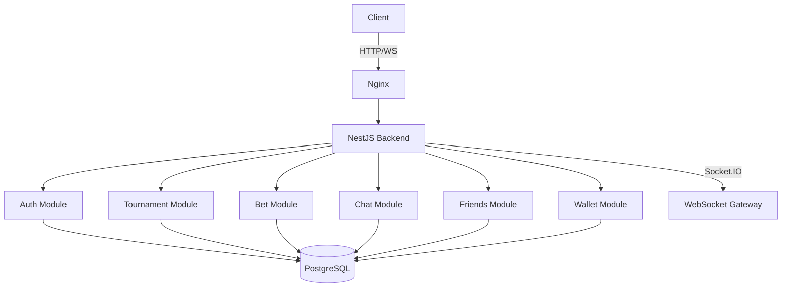

<div align="center">

# 🎮 Cube Arena

### Платформа игровых турниров с системой ставок и социальным взаимодействием

[](LICENSE)
[](https://www.typescriptlang.org/)
[](https://nestjs.com/)
[](https://nextjs.org/)
[](https://www.postgresql.org/)
[](https://www.docker.com/)

[Демо](#-демонстрация) • [Возможности](#-ключевые-возможности) • [Архитектура](#-архитектура) • [Установка](#-быстрый-старт)

<!-- Placeholder for demo GIF/video -->


🌍 **[English](README_EN.md) | [Русский](README_RU.md)**

</div>

---

## 📋 Содержание

- [О проекте](#-о-проекте)
- [Ключевые возможности](#-ключевые-возможности)
- [Технический стек](#-технический-стек)
- [Архитектура](#-архитектура)
- [Быстрый старт](#-быстрый-старт)
- [Разработка](#-разработка)
- [API документация](#-api-документация)
- [Deployment](#-deployment)
- [FAQ](#-faq)
- [Лицензия](#-лицензия)

---

## 🎯 О проекте

**Cube Arena** — это full-stack платформа для организации киберспортивных турниров с интегрированной системой ставок, социальным взаимодействием и управлением командами. Подходит как для небольших локальных турниров, так и для крупных киберспортивных событий.

### Целевая аудитория
- 🏆 Орган��заторы турниров
- 🎮 Игроки (соло и командные составы)
- 👥 Зрители и болельщики
- 👔 Менеджеры команд

### Почему Cube Arena?
- ✅ **Self-hosted** — полный контроль над данными
- ✅ **Open Source** — прозрачность и возможность кастомизации
- ✅ **Production Ready** — протестирован и готов к деплою
- ✅ **Scalable** — микросервисная архитектура
- ✅ **Secure** — JWT аутентификация, OAuth2, Rate Limiting

---

## ✨ Ключевые возможности

### 🏆 Турнирная система
- Создание и управление турнирами (Single/Double Elimination, Round Robin)
- Автоматическая генерация турнирной сетки
- Отслеживание статистики участников
- Система рейтингов и достижений
- Сохранение турниров (bookmarks)

### 💰 Система ставок
- Внутренняя валюта (Credits)
- Ставки на матчи в реальном времени
- История транзакций
- Защита от манипуляций
- Автоматическое начисление выигрышей

### 👥 Социальные функции
- Профили пользователей с настраиваемой приватностью
- Система друзей (Friends) и подписок (Follow)
- Командное взаимодействие (Teams)
- Блокировка пользователей
- Настройки конфиденциальности

### 💬 Коммуникация
- Real-time чат (Socket.IO)
- Личные сообщения
- Групповые чаты
- Уведомления (Email, Push, In-app)

### ⚙️ Управление аккаунтом
- Редактирование профиля
- Смена email и пароля
- Двухфакторная аутентификация (2FA)
- OAuth интеграция (Google, Discord)
- GDPR compliance (экспорт данных, удаление аккаунта)

### 🎨 Пользовательский опыт
- Адаптивный дизайн
- Темная/светлая тема
- Мультиязычность
- 3D визуализация (Three.js)
- Анимации (Framer Motion)

---

## 🛠 Технический стек

### Backend


- **Framework**: NestJS 10.0
- **Language**: TypeScript 5.1
- **Database**: PostgreSQL 15+ с TypeORM
- **Authentication**: JWT, Passport.js, OAuth2
- **WebSockets**: Socket.IO для real-time коммуникации
- **Validation**: class-validator, class-transformer
- **Documentation**: Swagger/OpenAPI
- **Security**: Rate Limiting, CORS, Helmet

### Frontend


- **Framework**: Next.js 14.2 (App Router)
- **Language**: TypeScript 5.3
- **UI Library**: React 18.3
- **Styling**: TailwindCSS 3.4
- **3D Graphics**: Three.js, React Three Fiber
- **Animations**: Framer Motion
- **State Management**: Zustand
- **Forms**: React Hook Form + Zod
- **HTTP Client**: Axios
- **Icons**: Lucide React

### DevOps


- **Containerization**: Docker, Docker Compose
- **Web Server**: Nginx (reverse proxy)
- **CI/CD**: GitHub Actions готов

---

## 🏗 Архитектура

### Структура проекта

```
cube-arena/
├── backend/                    # NestJS API
│   ├── src/
│   │   ├── modules/           # Бизнес-модули
│   │   │   ├── auth/         # Аутентификация (JWT, OAuth)
│   │   │   ├── users/        # Управление пользователями
│   │   │   ├── tournaments/  # Турнирная система
│   │   │   ├── matches/      # Управление матчами
│   │   │   ├── bets/         # Система ставок
│   │   │   ├── teams/        # Командное взаимодействие
│   │   │   ├── chat/         # Real-time чат
│   │   │   ├── friends/      # Социальный граф
│   │   │   ├── wallet/       # Управление балансом
│   │   │   ├── settings/     # Настройки пользователя
│   │   │   ├── account/      # Управление аккаунтом
│   │   │   ├── community/    # Сообщество и события
│   │   │   └── participants/ # Участники турниров
│   │   ├── entities/         # TypeORM entities (23 таблицы)
│   │   ├── database/         # Миграции и инициализация
│   │   └── main.ts           # Точка входа
│   ├── Dockerfile
│   └── package.json
│
├── frontend/                   # Next.js App
│   ├── src/
│   │   ├── app/              # Next.js App Router
│   │   │   ├── auth/         # Страницы авторизации
│   │   │   ├── tournaments/  # Список и детали турниров
│   │   │   ├── profile/      # Профили пользователей
│   │   │   ├── settings/     # 5 страниц настроек
│   │   │   ├── teams/        # Управление командами
│   │   │   ├── community/    # Сообщество
│   │   │   └── wallet/       # Кошелёк и транзакции
│   │   ├── components/       # Переиспользуемые компоненты
│   │   ├── lib/              # Утилиты (API client, helpers)
│   │   ├── types/            # TypeScript типы
│   │   └── styles/           # Глобальные стили
│   ├── Dockerfile
│   └── package.json
│
├── nginx/                      # Reverse Proxy
│   └── nginx.conf
│
├── docs/                       # Документация
│   ├── AGENTS.md               # Карта для AI-агентов
│   ├── SETTINGS_SYSTEM.md
│   ├── ACCOUNT_MODULE_COMPLETE.md
│   └── images/                # Скриншоты, диаграммы
│
├── docker-compose.yml          # Оркестрация контейнеров
├── .env.example               # Шаблон переменных окружения
└── README.md                  # Этот файл
```

### Модульная архитектура Backend



### Архитектурные решения

#### 1. Почему разделил Friends и Friendship?

**Friends** (подписки) и **Friendship** (взаимная дружба) — это две разные концепции:

**Follow (таблица `follows`)**
- Односторонняя связь (как в Twitter/Instagram)
- User A может подписаться на User B без взаимности
- Используется для: подписка на интересных игроков, отслеживание статистики
- Запросы: `GET /api/friends/following`, `GET /api/friends/followers`

**Friendship (таблица `friendships`)**
- Двусторонняя связь (подтверждённая дружба)
- Требует запроса (`friend_requests`) и подтверждения
- Даёт дополнительные права: видеть приватную информацию, приглашать в команды
- Запросы: `GET /api/friends/list`, `POST /api/friends/request`

**Преимущества разделения:**
- Гибкая социальная сеть (можно следить без добавления в друзья)
- Разные уровни приватности
- Лучшая производительность (отдельные индексы)

#### 2. Как защищён Wallet?

**Многоуровневая защита:**

```typescript
// 1. Транзакционность (ACID)
@Transaction()
async placeBet(userId: string, amount: number) {
  // Все операции в одной транзакции
  const wallet = await this.walletRepo.findOne({ userId }, { lock: 'pessimistic_write' });
  if (wallet.balance < amount) throw new InsufficientFundsException();
  
  wallet.balance -= amount;
  await this.walletRepo.save(wallet);
  
  await this.transactionRepo.save({ type: 'BET_PLACED', amount, userId });
}
```

**Защитные механизмы:**
- ✅ **Pessimistic Locking** — блокировка строки на время транзакции (предотвращает race conditions)
- ✅ **Transaction Isolation** — все операции изолированы
- ✅ **Validation Guards** — проверка баланса перед списанием
- ✅ **Audit Trail** — логирование каждой транзакции в `transactions` таблице
- ✅ **Rate Limiting** — защита от spam атак (Throttler)
- ✅ **JWT Authentication** — только авторизованные пользователи
- ✅ **Idempotency Keys** — предотвращение дублирования транзакций

#### 3. Как начисляются награды?

**Автоматическое начисление после завершения матча:**

```typescript
// tournaments/tournaments.service.ts
async completeMatch(matchId: string, winnerId: string) {
  await this.dataSource.transaction(async (manager) => {
    // 1. Обновить статус матча
    await manager.update(Match, { id: matchId }, { 
      status: 'completed', 
      winnerId 
    });
    
    // 2. Найти все ставки на этот матч
    const winningBets = await manager.find(Bet, {
      where: { matchId, predictedWinnerId: winnerId }
    });
    
    // 3. Начислить выигрыши
    for (const bet of winningBets) {
      const payout = bet.amount * bet.odds;
      
      await manager.increment(Wallet, 
        { userId: bet.userId }, 
        'balance', 
        payout
      );
      
      await manager.save(Transaction, {
        userId: bet.userId,
        type: 'BET_WIN',
        amount: payout,
        reference: matchId
      });
    }
    
    // 4. Обновить статус ставок
    await manager.update(Bet, 
      { matchId }, 
      { status: 'settled' }
    );
  });
}
```

**Что происходит:**
1. Матч завершается организатором турнира
2. Триггерится метод `completeMatch()`
3. В рамках **одной транзакции**:
   - Обновляется статус матча
   - Находятся все выигрышные ставки
   - Начисляются выигрыши на кошельки
   - Создаются записи в истории транзакций
   - Обновляется статус ставок

#### 4. Что если сервер падает посередине начисления?

**PostgreSQL транзакции гарантируют атомарность:**

```
Сценарий: Начисление 5 выигрышей, сервер падает после 3-го

❌ БЕЗ транзакций:
  ✅ User 1: +100 CR (начислено)
  ✅ User 2: +200 CR (начислено)
  ✅ User 3: +150 CR (начислено)
  💥 Server crash
  ❌ User 4: +300 CR (НЕ начислено)
  ❌ User 5: +250 CR (НЕ начислено)
  
  Результат: Потеря данных, несправедливые выплаты

✅ С транзакциями (наш подход):
  🔄 Transaction start
  ⏸️  User 1: +100 CR (в памяти)
  ⏸️  User 2: +200 CR (в памяти)
  ⏸️  User 3: +150 CR (в памяти)
  💥 Server crash
  🔙 ROLLBACK — все изменения отменены
  
  Результат: Данные остались в исходном состоянии
```

**При перезапуске сервера:**
- Система проверяет незавершённые матчи (`status = 'in_progress'`)
- Администратор может повторно завершить матч
- Транзакция выполнится полностью или не выполнится вообще

#### 5. Почему выбрал такую структуру модулей?

**Принципы организации кода:**

```
📦 Модульная архитектура (по доменам)
├── auth/          → Аутентификация, авторизация
├── users/         → CRUD пользователей
├── tournaments/   → Бизнес-логика турниров
├── matches/       → Управление матчами
├── bets/          → Изолированная логика ставок
├── wallet/        → Финансовые операции
├── teams/         → Командное взаимодействие
├── chat/          → Real-time коммуникация
├── friends/       → Социальный граф
├── settings/      → Настройки пользователя
└── account/       → Управление аккаунтом
```

**Преимущества такого подхода:**

1. **Separation of Concerns** — каждый модуль отвечает за одну область
2. **Независимость** — модули можно разрабатывать параллельно
3. **Тестируемость** — легко писать unit-тесты для изолированных модулей
4. **Масштабируемость** — можно вынести модуль в отдельный микросервис
5. **Читаемость** — структура проекта понятна новым разработчикам

---

## 🚀 Быстрый старт

### Предварительные требования

- **Docker** 20.10+ и **Docker Compose** 2.0+
- **Node.js** 20+ (только для локальной разработки без Docker)
- **PostgreSQL** 15+ (если запускаете без Docker)

### Установка с Docker (рекомендуется)

```bash
# 1. Клонировать репозиторий
git clone https://github.com/mrbezarate/Cube-Aren.git
cd Cube-Aren

# 2. Скопировать переменные окружения
cp .env.example .env

# 3. (Опционально) Отредактировать .env
nano .env

# 4. Запустить все сервисы
docker-compose up -d --build

# 5. Проверить статус
docker-compose ps
```

**Сервисы будут доступны:**
- 🌐 Frontend: http://localhost
- 📚 API Docs (Swagger): http://localhost/api/docs
- 🔌 Backend API: http://localhost:3001 (внутри контейнера)

### Локальная разработка (без Docker)

```bash
# Backend
cd backend
npm install
npm run dev

# Frontend (в другом терминале)
cd frontend
npm install
npm run dev
```

---

## 📝 Доступные команды

### Backend
```bash
npm run dev          # Запуск в режиме разработки
npm run build        # Production сборка
npm run start        # Запуск production сборки
npm run test         # Запуск тестов
npm run lint         # Проверка кода
```

### Frontend
```bash
npm run dev          # Запуск в режиме разработки
npm run build        # Production сборка
npm run start        # Запуск production сборки
npm run lint         # Проверка кода
```

### Docker
```bash
docker-compose up -d      # Запуск все сервисы
docker-compose down       # Остановка сервисов
docker-compose logs -f    # Логи всех сервисов
```

---

## 📚 Разработка

### Структура коммитов

Используем Conventional Commits:

```
feat: добавлена система ставок
fix: исправлена ошибка авторизации
docs: обновлена документация
style: форматирование кода
refactor: переструктурирован модуль аутентификации
test: добавлены тесты для wallet
```

### Основной workflow

1. Создайте ветку: `git checkout -b feature/amazing-feature`
2. Коммитьте изменения: `git commit -m 'feat: добавлена функция'`
3. Отправьте ветку: `git push origin feature/amazing-feature`
4. Откройте Pull Request

---

## 📖 API Документация

API документация доступна по адресу `/api/docs` (Swagger UI).

### Основные endpoints

| Метод | Endpoint | Описание |
|-------|----------|---------|
| POST | `/api/auth/register` | Регистрация |
| POST | `/api/auth/login` | Вход |
| GET | `/api/tournaments` | Список турниров |
| POST | `/api/tournaments` | Создание турнира |
| GET | `/api/tournaments/:id` | Детали турнира |
| POST | `/api/bets` | Размещение ставки |
| GET | `/api/wallet/balance` | Баланс кошелька |

Полная документация API: [API.md](docs/API.md)

---

## 🐛 Deployment

### Требования

- VPS с 2+ ядрами и 4GB RAM (рекомендуется)
- Docker и Docker Compose
- Доменное имя (optional)
- SSL сертификат (рекомендуется)

### Развёртывание на VPS

```bash
# SSH на сервер
ssh user@your-server.com

# Клонировать репозиторий
git clone https://github.com/mrbezarate/Cube-Aren.git
cd Cube-Aren

# Настроить переменные
cp .env.example .env
nano .env

# Запустить контейнеры
docker-compose -f docker-compose.prod.yml up -d

# Проверить статус
docker-compose ps
```

### CI/CD с GitHub Actions

GitHub Actions автоматически:
- 🧪 Запускает тесты на каждый commit
- 🏗️ Собирает образы Docker
- 🚀 Развёртывает на VPS (при merge в main)

Конфигурация: `.github/workflows/deploy.yml`

---

## ❓ FAQ

### Как добавить нового пользователя?

```bash
curl -X POST http://localhost:3001/api/auth/register \
  -H "Content-Type: application/json" \
  -d '{"email":"user@example.com","password":"password123"}'
```

### Как сбросить базу данных?

```bash
docker-compose down -v
docker-compose up -d --build
```

### Как просмотреть логи?

```bash
docker-compose logs -f backend
docker-compose logs -f frontend
```

### Как добавить новый модуль?

```bash
# Используйте NestJS CLI
nest generate module modules/my-feature
nest generate service modules/my-feature
nest generate controller modules/my-feature
```

---

## 📄 Лицензия

Проект распространяется под лицензией MIT. См. [LICENSE](LICENSE) для подробностей.

---

**👤 Автор:** [@mrbezarate](https://github.com/mrbezarate)  
**⭐ Если проект полезен, дайте звезду!**

**Иные ссылки:**
- [Issues](https://github.com/mrbezarate/Cube-Aren/issues)
- [Discussions](https://github.com/mrbezarate/Cube-Aren/discussions)
- [Code of Conduct](CODE_OF_CONDUCT.md)
